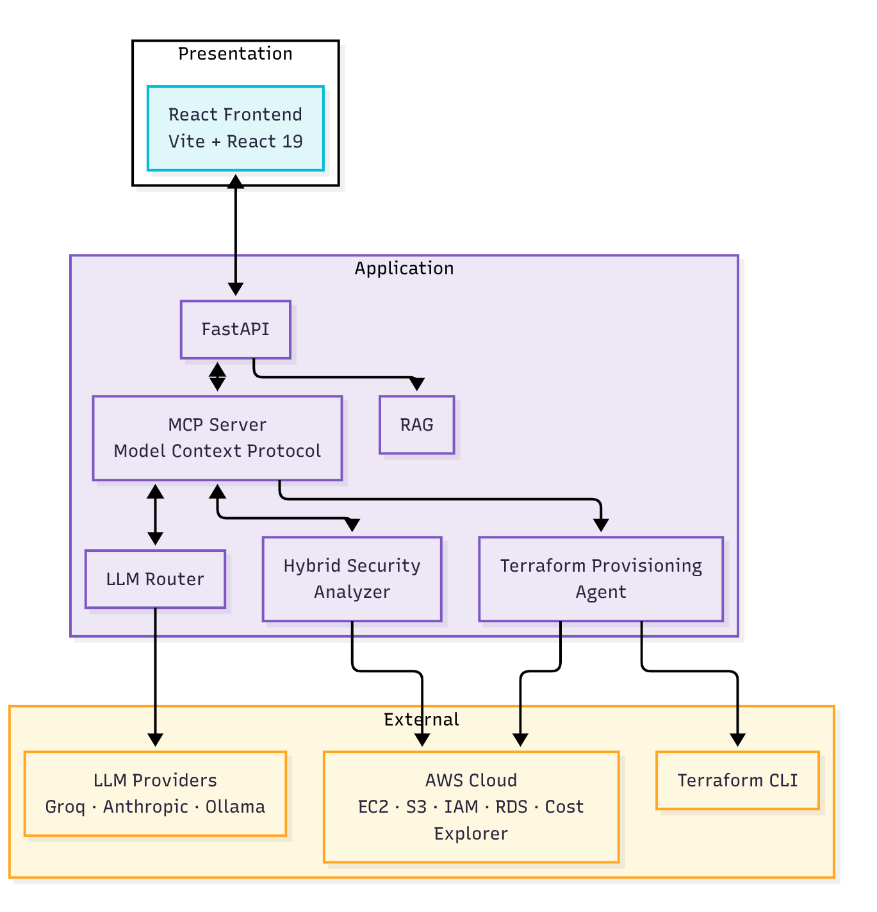

# cloudxtc — Agentic Cloud Experience Platform

> Talk to your cloud. Let AI do the work.

cloudxtc is an AI-powered AWS management tool built on the **Model Context Protocol (MCP)**. Instead of clicking through the AWS Console, you describe what you need — cloudxtc scans your cloud, finds the problems, writes the fixes, and waits for your approval before touching anything.

```
Browser → React UI → POST /mcp → FastMCP Server → MCP Tools → AWS / LLM / Terraform
                               └→ Claude Desktop (stdio mode)
                               └→ Claude Code (HTTP mode)
```



---

## Clients

cloudxtc connects from three places simultaneously — same backend, same 30+ tools:

| Client | Transport | How to connect |
|---|---|---|
| **Browser** | HTTP | Full React dashboard at `http://localhost:5173` |
| **Claude Desktop** | stdio | Launched as a subprocess via MCP config (see [Integration](#claude-desktop--claude-code-integration)) |
| **Claude Code CLI** | HTTP | Add `http://localhost:8000/mcp` as a streamable-HTTP MCP server |

---

## How It Works

### 01 — Scan
Enter your AWS credentials and click **Scan**. cloudxtc runs five parallel scanners across EC2, S3, IAM, Security Groups, and VPCs and populates the dashboard in seconds.

### 02 — Analyse
Click **Analyse** on the Security or Cost panel. The 7-rule engine flags every misconfiguration, assigns severity (HIGH / MEDIUM / LOW), and an LLM writes a plain-English summary of what's wrong and why.

### 03 — Fix & Approve
Choose direct revoke (instant), manual Terraform generation, or the autonomous agent. cloudxtc shows you the full `terraform plan` diff before anything changes. You approve. It applies.

> cloudxtc never applies a change without your explicit approval.

---

## Features

### Infrastructure & Security
- **AWS scanning** — EC2, S3, IAM, Security Groups, VPCs, and SG usage maps (via ENIs, covering all resource types); auto-refreshes every 90 seconds
- **7-rule security engine** — open SSH/RDP, public S3, missing MFA, root account usage, over-permissive IAM, inactive users, default VPC; severity-ranked HIGH / MEDIUM / LOW with a 0–100 health score
- **Direct fix** — one-click `revoke_open_ingress_rule` removes 0.0.0.0/0 rules for SSH / RDP without generating Terraform
- **Cost monitoring** — current month spend, 3-month trend, per-service breakdown, 20%+ spike anomaly detection, LLM optimisation recommendations

### Terraform Pipeline
- **HCL generation** — describe any AWS resource in plain English; the LLM scans live infra first to reference real VPC / SG / subnet IDs and avoid conflicts
- **Syntax validation** — `terraform validate` runs automatically after every generation
- **Human-in-the-loop execution** — `terraform plan` runs first and shows a full diff; `terraform apply` fires only on explicit approval; `terraform destroy` available for instant rollback
- **Remote S3 state** — when `TF_STATE_BUCKET` is set, state is stored in S3 with DynamoDB locking; concurrent applies are safe
- **Plugin cache** — provider binaries (~727 MB) downloaded once and hardlinked across all executions

### AI & Knowledge
- **Agentic remediation** — autonomous agent scans AWS, picks the highest-severity finding, generates a Terraform fix, plans it, and presents a plain-English summary for sign-off
- **Infrastructure chat** — ask questions about your live AWS environment in plain English; every message is grounded in a fresh scan, augmented with up to 3 relevant knowledge base chunks
- **RAG knowledge base** — ChromaDB vector store auto-seeded with 5 AWS best-practice documents on first start; add custom PDFs or text files and ask questions grounded by retrieved chunks

### Operations
- **Execution history & audit log** — persistent, file-locked JSON log of every plan/apply/destroy with timestamps, status, and full terminal output; mark findings resolved without deletion
- **PEM key download** — EC2 instances created with a new key pair generate a downloadable `.pem` file served at `/terraform/keys/{id}/{filename}`
- **Startup workdir cleanup** — plan-only working directories older than 7 days are automatically purged on server start to reclaim disk space
- **Claude Desktop & Claude Code** — the same MCP server runs in stdio mode (Desktop) or HTTP mode (Code); 30+ tools available as slash commands

---

## Prerequisites

| Requirement | Notes |
|---|---|
| Python 3.10+ | Backend runtime |
| Node.js 18+ | Frontend build tooling |
| Terraform CLI 1.x | Must be on `$PATH` — verify with `terraform --version` |
| AWS account | Programmatic access key + secret key required |
| LLM API key | Groq (free tier sufficient) **or** Anthropic |

---

## Quick Start

### Backend

```bash
cd backend

python -m venv venv
source venv/bin/activate        # Windows: venv\Scripts\activate

pip install -r requirements.txt

cp .env.example .env
nano .env                       # fill in your LLM API key

uvicorn main:app --reload --port 8000
```

The server exposes:

| Interface | URL | Purpose |
|---|---|---|
| MCP endpoint | `POST http://localhost:8000/mcp` | Primary — used by the React frontend and all MCP clients |
| Swagger UI | `http://localhost:8000/docs` | Auto-generated test UI for every MCP tool |
| Key download | `GET http://localhost:8000/terraform/keys/{id}/{file}` | Binary PEM file download |
| RAG upload | `POST http://localhost:8000/rag/documents/upload` | Multipart PDF / text file upload |

### Frontend

```bash
cd frontend
npm install
npm run dev
```

The UI will be available at `http://localhost:5173`. The frontend communicates **exclusively** via `POST /mcp` — there are no separate REST calls for business logic.

---

## First Run

1. Open `http://localhost:5173` in your browser.
2. Log in — **username:** `admin` **password:** `demo2024`.
3. Click **Settings** (top-right) → **Cloud Credentials** tab — enter your AWS Access Key ID, Secret Key, and preferred region.
4. On the **LLM Settings** tab, enter your Groq or Anthropic API key and select a model.
5. Close settings and click **Scan** — all five AWS scanners will run and populate the dashboard.
6. Click **Analyse** on the Security panel to run the 7-rule engine and generate an LLM summary.

> **Security note:** AWS credentials are never stored on disk — they are passed at request time and forwarded directly to boto3. The `admin / demo2024` login is hardcoded for local development only; do not expose this application to the public internet without replacing the authentication layer.

---

## Environment Variables

All variables live in `backend/.env` (copy from `backend/.env.example`):

| Variable | Required | Description |
|---|---|---|
| `GROQ_API_KEY` | One of these | Groq API key — used when model is set to `groq` |
| `ANTHROPIC_API_KEY` | One of these | Anthropic API key — used when model is set to `anthropic` |
| `AWS_DEFAULT_REGION` | No | Default AWS region (default: `us-east-1`) |
| `AWS_ACCESS_KEY_ID` | No | Server-side AWS key; prefer IAM roles in production |
| `AWS_SECRET_ACCESS_KEY` | No | Server-side AWS secret |
| `TF_STATE_BUCKET` | No | S3 bucket for Terraform state (enables S3 backend when set) |
| `TF_STATE_LOCK_TABLE` | No | DynamoDB table for state locking (default: `terraform-state-lock`) |
| `TF_STATE_REGION` | No | Region for S3 bucket and DynamoDB table (default: `us-east-1`) |
| `DEBUG` | No | Set `true` for FastAPI debug/reload mode; use `false` in production |

---

## Terraform S3 State Backend (Optional)

By default Terraform writes state locally into `terraform_workdirs/`. For production or any setup where state must be durable and concurrent-apply safe, configure a remote S3 backend.

### One-shot setup

```bash
# Auto-names the bucket using your AWS account ID
./setup_s3_backend.sh

# Or specify a custom name / region
./setup_s3_backend.sh --bucket my-tfstate-bucket --region eu-west-1

# Dry-run to preview what will happen without making changes
./setup_s3_backend.sh --dry-run
```

The script:
1. Creates an S3 bucket with versioning, AES-256 server-side encryption, and all public access blocked
2. Creates a DynamoDB table (`terraform-state-lock`) for concurrent-apply locking
3. Writes `TF_STATE_BUCKET`, `TF_STATE_LOCK_TABLE`, and `TF_STATE_REGION` into `backend/.env`

Safe to run multiple times — it skips resources that already exist.

### After setup

```bash
# Restart the backend to pick up the new .env vars
cd backend && uvicorn main:app --reload --port 8000

# After a plan + apply, verify state landed in S3
aws s3 ls s3://$(grep TF_STATE_BUCKET backend/.env | cut -d= -f2)/ --recursive
```

### How it works

When `TF_STATE_BUCKET` is present, `execution_service.py` writes a `backend.tf` alongside `main.tf` before running `terraform init`:

```hcl
terraform {
  backend "s3" {
    bucket         = "<bucket>"
    key            = "<execution_id>/terraform.tfstate"
    region         = "<region>"
    dynamodb_table = "terraform-state-lock"
    encrypt        = true
  }
}
```

Each execution gets its own isolated state key (`exec_YYYYMMDD_HHMMSS_xxxxxxxx/terraform.tfstate`). The DynamoDB lock is acquired automatically at the start of `apply` and released when it completes — preventing concurrent applies from corrupting state.

| | Local mode (default) | S3 mode |
|---|---|---|
| State stored in | `backend/terraform_workdirs/` | S3 bucket |
| Concurrent apply protection | None | DynamoDB lock |
| State survives process restart | Yes (local files) | Yes (S3) |
| Multi-machine safe | No | Yes |

---

## Claude Desktop & Claude Code Integration

The MCP server can be connected directly to Claude Desktop or Claude Code without the React UI.

### Claude Code (HTTP transport)

```bash
# Start the server
cd backend && python mcp_server.py

# Add to Claude Code MCP config
# URL: http://localhost:8000/mcp   type: streamable-http
```

### Claude Desktop (stdio transport)

Claude Desktop launches the server as a subprocess — no manual start needed:

```json
{
  "mcpServers": {
    "agentic-cloud-assistant": {
      "command": "/absolute/path/to/venv/bin/python",
      "args": ["/absolute/path/to/backend/mcp_server.py", "--stdio"],
      "env": {
        "PYTHONPATH": "/absolute/path/to/backend",
        "AWS_ACCESS_KEY_ID": "your-key-id",
        "AWS_SECRET_ACCESS_KEY": "your-secret",
        "AWS_DEFAULT_REGION": "us-east-1",
        "GROQ_API_KEY": "your-groq-key",
        "ANTHROPIC_API_KEY": "your-anthropic-key"
      }
    }
  }
}
```

See `claude_desktop_config_example.json` for the full template.

---

## MCP Tool Reference

All tools are callable via `POST /mcp` (JSON-RPC `tools/call`) or the Swagger UI at `/docs`.

### Group A — AWS Scanning

| Tool | Description |
|---|---|
| `health_check` | Returns server status and confirms MCP connection |
| `full_aws_scan` | Runs all five scanners (EC2, S3, IAM, SGs, VPCs) in sequence |
| `scan_ec2_instances` | EC2 instances with state, IPs, and attached security group IDs |
| `scan_s3_buckets` | S3 buckets with public-access status |
| `scan_iam_users` | IAM users with MFA status and last-login date |
| `scan_security_groups_detail` | Security groups flagged for dangerous internet-facing rules |
| `scan_vpc_detail` | VPCs with CIDR, default flag, and subnet count |

### Group B — Security & Cost

| Tool | Description |
|---|---|
| `scan_sg_usage_tool` | Maps every SG to attached resources (EC2, RDS, ALB, Lambda, ECS, ElastiCache) via ENIs; identifies unused SGs |
| `analyse_security_findings` | Runs 7 built-in rules against a pre-fetched scan dict |
| `run_security_analysis_with_summary` | Full scan + rules + LLM plain-English summary in one call |
| `estimate_costs` | Cost Explorer data: current month, 3-month trend, per-service, anomaly |
| `get_cost_with_summary` | Cost data + LLM optimisation recommendations in one call |

### Group C — Terraform

| Tool | Description |
|---|---|
| `generate_terraform_hcl` | Generate HCL from a resource type + config dict |
| `generate_terraform_from_request` | Generate HCL from plain English; scans existing infra for context first |
| `validate_terraform_plan` | Validate HCL syntax via `terraform validate` without touching AWS |
| `run_terraform_plan_mcp` | Write HCL to a working dir, run `terraform init + plan` (S3 backend or local), return diff and execution ID |
| `run_terraform_apply_mcp` | Apply or reject a previously planned execution (human gate: `approved: bool`) |
| `get_execution_history_tool` | Return all plan/apply/destroy records from the execution log |
| `summarise_plan_for_human` | Parse raw plan output into a plain-English approval summary |

### Group D — Chat & Agent

| Tool | Description |
|---|---|
| `aws_chat` | Chat with an LLM about live AWS state; injects a full scan as context, augmented with relevant knowledge base chunks |
| `agent_run` | Autonomous agent: scan → pick top finding → generate fix → plan → summarise |
| `agent_approve` | Human approval gate for agent-generated plans |
| `revoke_open_ingress_rule` | Direct AWS SDK fix — removes all 0.0.0.0/0 rules for a given port on a SG |
| `mark_execution_resolved` | Mark a finding execution as resolved in the audit log (audit-safe, no deletion) |
| `rollback_execution` | Run `terraform destroy` on a completed execution's saved main.tf |

### Group E — RAG Knowledge Base

| Tool | Description |
|---|---|
| `rag_query_tool` | Semantic search over ChromaDB + LLM-grounded answer |
| `rag_list_documents` | List all documents and chunk counts in the knowledge base |
| `rag_add_text_document` | Add a raw text document to ChromaDB |
| `rag_upload_file` | Add a PDF or text file (base64-encoded) to ChromaDB; PDFs parsed with PyPDF2 |
| `rag_delete_document` | Delete a document and all its chunks |

### MCP Resources (pulled on demand)

| URI | Description |
|---|---|
| `aws://findings/{region}` | Latest security findings for a region (TTL-cached 5 min) |
| `aws://cost-summary/{region}` | Latest cost summary for the account (TTL-cached 5 min) |

---

## Project Structure

```
aca-app-dev/
│
├── README.md
├── setup_s3_backend.sh              # One-shot S3 state bucket + DynamoDB lock table setup
├── claude_desktop_config_example.json  # Claude Desktop / Claude Code MCP config template
│
├── backend/
│   ├── main.py                      # FastAPI app — mounts MCP server, serves /docs, key downloads, RAG upload
│   ├── mcp_server.py                # All MCP tools and 2 MCP resources (Groups A–E)
│   ├── docs_generator.py            # Auto-registers every MCP tool as a Swagger POST /tools/{name}
│   ├── benchmark.py                 # Endpoint latency benchmarking
│   ├── requirements.txt
│   ├── .env.example
│   ├── providers_init.tf            # Terraform provider pinning for local validation
│   ├── execution_log.json           # Persistent Terraform execution history (file-locked JSON)
│   ├── terraform_workdirs/          # Per-execution working dirs (main.tf, backend.tf, tfplan, .terraform/)
│   ├── terraform_plugin_cache/      # Shared provider plugin cache (~727 MB, hardlinked across executions)
│   ├── tests/
│   │   ├── test_rag_functional.py   # 41 unit tests — RAG chunking, search, delete, prompt building
│   │   ├── test_rag_integration.py  # 35 integration tests — live HTTP API for all RAG endpoints
│   │   ├── test_security_analyzer.py # 28 unit tests — all 7 security rules and run_security_analysis
│   │   └── test_ollama_status.py    # 5 unit tests — Ollama probe states and pull stream handling
│   ├── services/
│   │   ├── aws_scanner.py           # boto3 — EC2, S3, IAM, SGs, VPCs, SG usage, direct revoke
│   │   ├── security_analyzer.py     # 7-rule security engine + severity scoring (HIGH/MEDIUM/LOW)
│   │   ├── cost_analyzer.py         # Cost Explorer queries + anomaly detection
│   │   ├── terraform_service.py     # HCL generation (Groq/Anthropic/Ollama), validation, summarisation
│   │   ├── execution_service.py     # terraform plan/apply/destroy subprocesses + S3 backend + file-locked log
│   │   └── llm_service.py           # Groq / Anthropic / Ollama client wrappers
│   └── rag/
│       ├── knowledge_base.py        # ChromaDB wrapper — all-MiniLM-L6-v2, chunk size 400 / overlap 50
│       ├── rag_service.py           # Query pipeline — cosine search, relevance threshold 0.3, prompt augmentation
│       └── seed_knowledge.py        # Pre-populates knowledge base with 5 seed documents on first start
│
├── frontend/
│   ├── index.html
│   ├── package.json
│   ├── vite.config.js               # Dev server with proxy → backend:8000
│   └── src/
│       ├── App.jsx                  # Root component — provider tree, routing, settings modal
│       ├── main.jsx
│       ├── api/
│       │   └── mcpClient.js         # JSON-RPC 2.0 MCP client — SSE streaming, session, retry
│       ├── contexts/
│       │   ├── ApiKeyContext.jsx    # Global credential state (AWS keys, LLM keys, region)
│       │   └── AuthContext.jsx      # Login session state and logout handler
│       ├── utils/
│       │   ├── scoring.js           # Security health score (0–100) from findings
│       │   └── constants.js
│       └── components/
│           ├── Dashboard.jsx        # Main layout — panel grid, scan orchestration, auto-refresh
│           ├── LoginPage.jsx
│           ├── SettingsModal.jsx    # AWS credentials + LLM settings modal
│           ├── ui/
│           │   ├── Topbar.jsx       # Nav bar with health score badge and settings button
│           │   ├── ErrorBoundary.jsx
│           │   ├── Field.jsx
│           │   ├── Logo.jsx
│           │   └── DarkTooltip.jsx
│           └── panels/
│               ├── InfrastructurePanel.jsx   # EC2 / S3 / IAM / SG / VPC summary cards
│               ├── SecurityPanel.jsx         # Findings list, health score, fix buttons
│               ├── CostPanel.jsx             # Cost breakdown, trend chart, anomaly alert
│               ├── ChatPanel.jsx             # LLM chat with conversation memory
│               ├── TerraformPanel.jsx        # HCL generator → plan → approve → apply
│               ├── ExecutionHistoryPanel.jsx # Plan/apply/destroy history with rollback
│               ├── SecurityAgentPanel.jsx    # Agentic remediation loop UI
│               └── KnowledgeBasePanel.jsx    # RAG search, document upload/delete
│
└── aca-diagrams/                    # Architecture and design diagrams (PNG)
    ├── HIGH_LEVEL_SYSTEM_ARCHITECTURE.png
    ├── SEQUENCE_DIAGRAM_SCAN_TO_FIX.png
    ├── ACTIVITY_DIAGRAM_TERRAFORM_WORKFLOW.png
    └── ...
```
